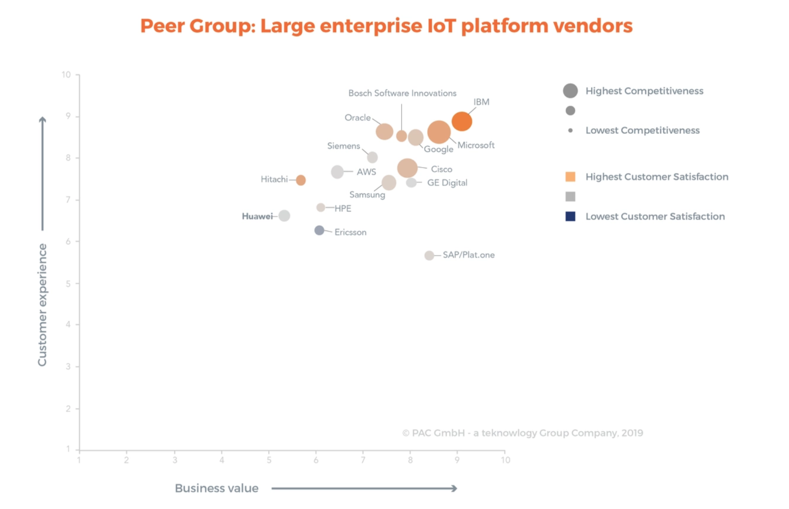
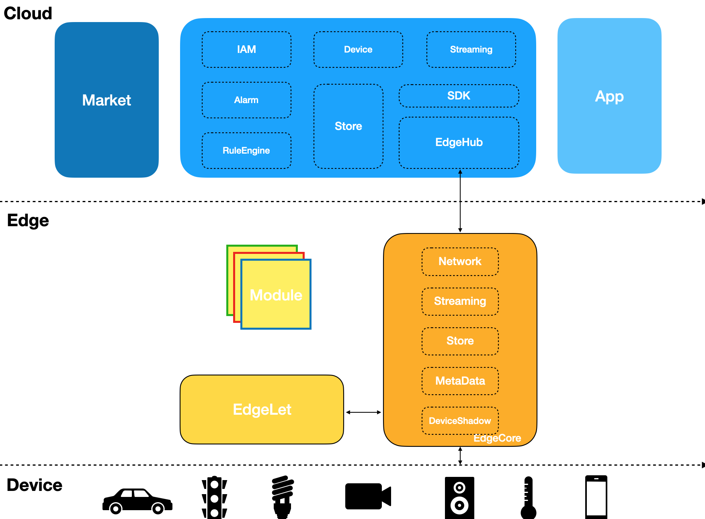
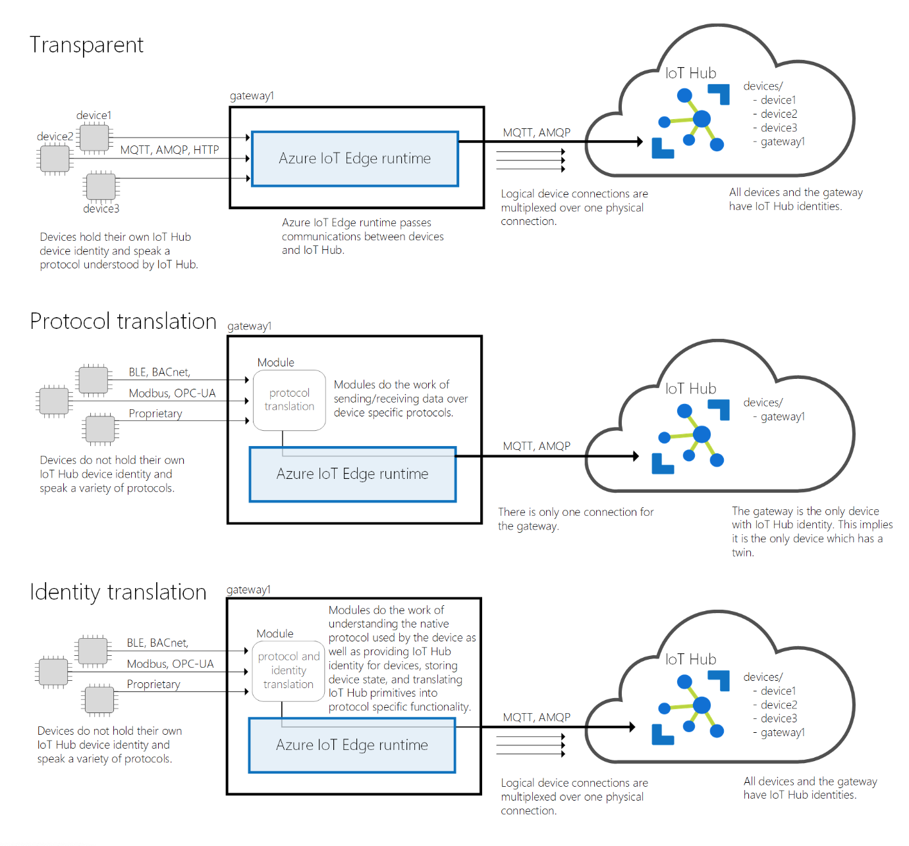
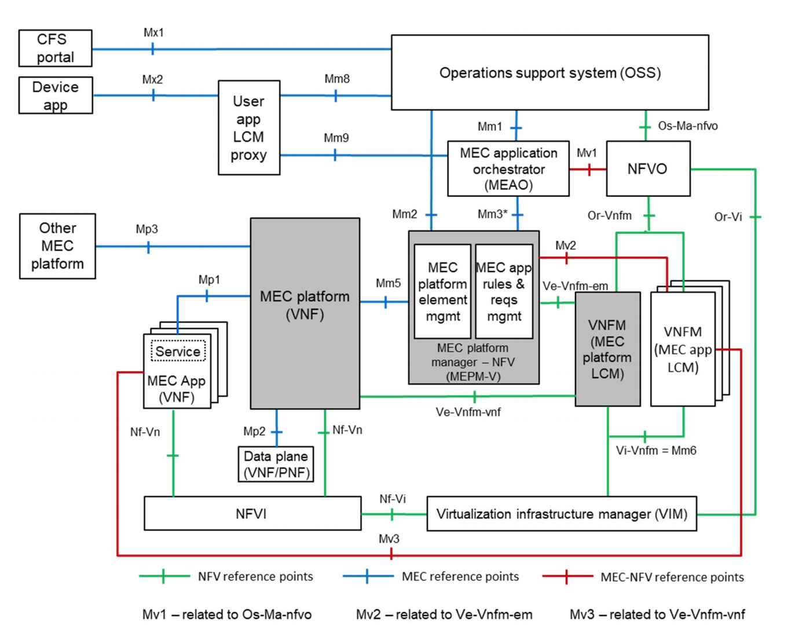
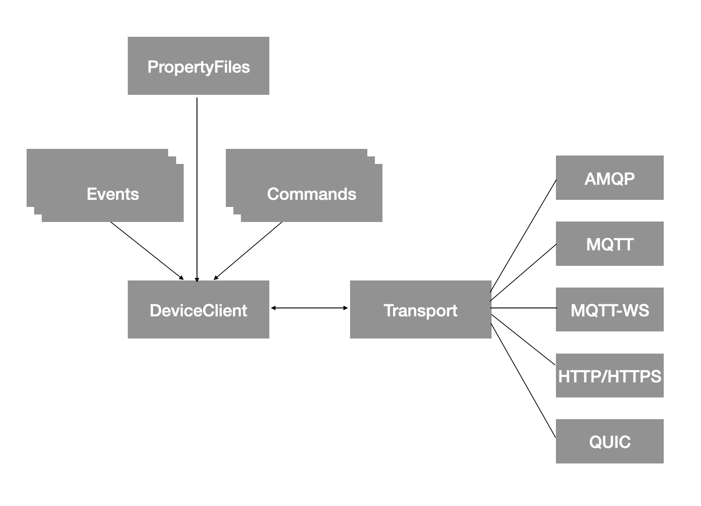
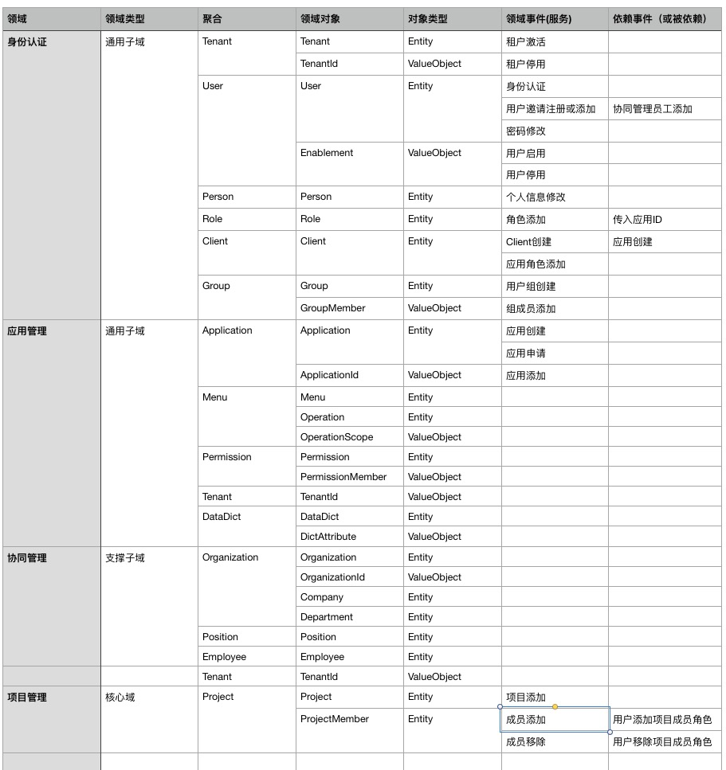
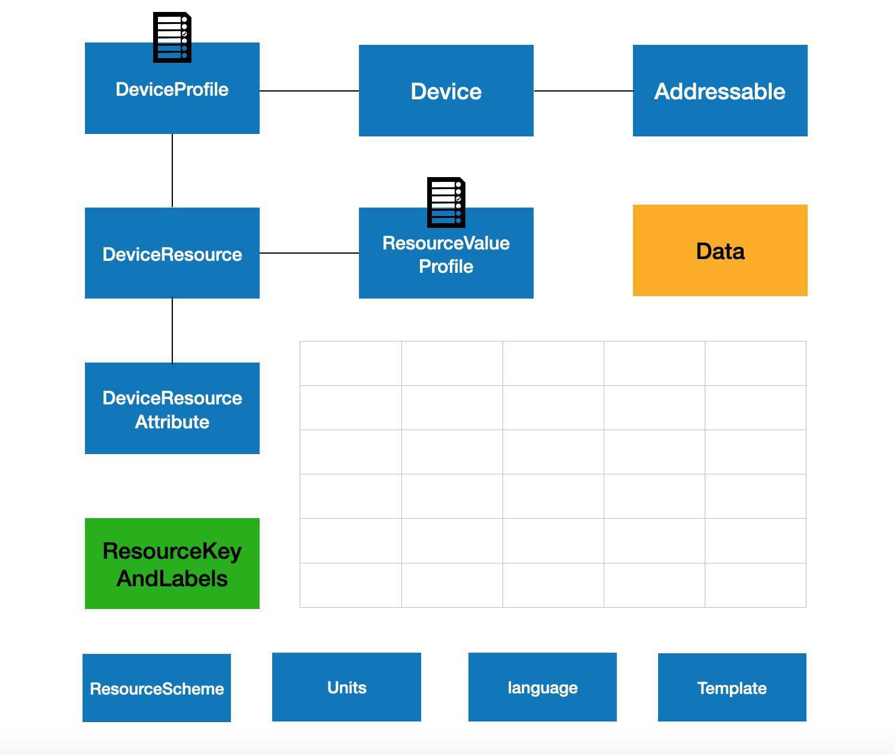
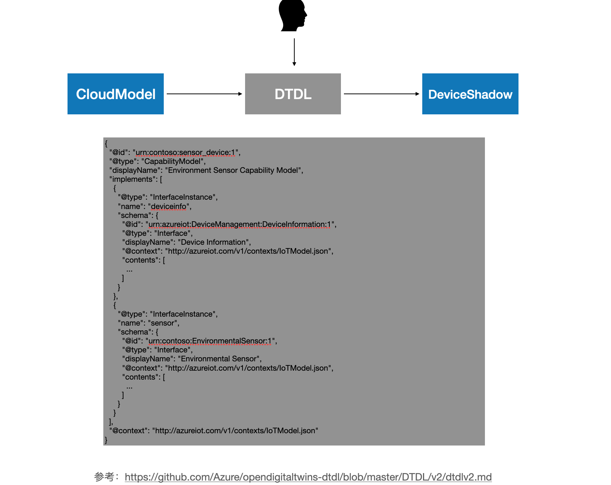
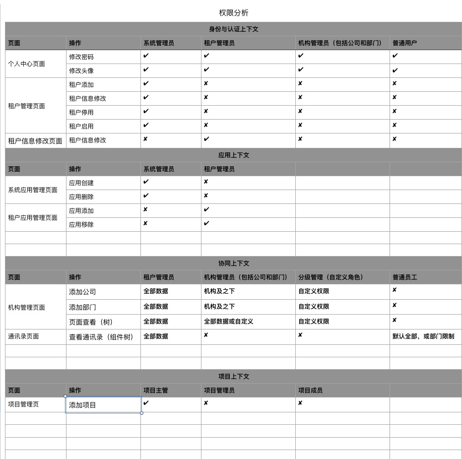

## 一、概览

#### 参与者

 

+ 开源边缘计算平台（主要分为四类：一类功能包括边缘节点容器编排、协议转换、计算、设备异构化管理等功能，设备与计算资源统一抽象管理；另一类专注于设备模型，以及数据的流转，包括Cloud端和Edge，不提供容器编排功能；第三类是聚焦边缘计算，并提供云生态，适配多云，包括从应用开发到交付的全生态链，突出5G能力的新型平台；第4类边缘操作系统，包括腾讯、华为）
  + [KubeEdge](https://kubeedge.io/)(第一类，华为，CNCF项目，18年开始，降低边缘容器的资源耗费、设备协议的适配、平台传输通信的支持、设备的管理，将设备虚拟化为资源，不绑定某一生态)
  + [Baetyl](https://baetyl.io/)(第一类，同上，百度，LFE项目，19年。CNCF与LFE同属于Linux Foundation，与百度生态结合方便)
  + [Akri](https://github.com/deislabs/akri)(第一类，微软，并且把设备也抽象化为K8S里的资源)
  + [Edgexfoundry](https://www.edgexfoundry.org/)(Linux Foundation，第二类，但也提供容器化部署方案，提供了很好的设备物模型，可以参考设计)
  + [Sitewhere](https://sitewhere.io/)(第二类，Java的物联网平台，服务划分明确，使用了常见的中间件实现)
  + [Thingsboard](https://thingsboard.io/)(第二类，包括规则引擎的实现)
  + [EdgeGallery](http://www.edgegallery.org)(第三类，华为，开源MEC平台，可以跨多供应商多访问边缘计算（MEC）平台，无缝地集成来自供应商，服务提供商和第三方的应用程序)
  + 其他如[Azure-Iot](https://docs.microsoft.com/en-us/azure/iot-edge/)、[AWS-Iot](https://docs.aws.amazon.com/zh_cn/iot/latest/developerguide/what-is-aws-iot.html)、[Ali-Iot](https://www.alibabacloud.com/help/zh/doc-detail/73727.htm)，开源或半开源，文档丰富，可以帮助理解业务概念，以及架构借鉴。
+ 展望
  + 容器不是边缘模块的最好部署形式，WASM正在发展，其轻量化的特点非常适合边缘插件的实现
  + Rust运行时小的特点，非常适合用作边缘平台
  + 编排层容器加WASM是未来的方向，工业设备、家居、汽车模型应该会不同
  + 越来越多的能力会从云下放到边缘中
  + 数据交换协议会不断变换，长期需要适配各种协议，IPv6、QUIC会到来
+ 当前实现
  + MQTT协议与ModBus协议转换，Platform实现MQTTServer
  + 通用设备模型（数字孪生）设计（设备、事件、命令）与模版功能
  + 存储与展示分离，Platform提供数据的镜像分发能力
  + Edge与Platform功能边界划分，如一些功能放在Edge实时处理端，基于事件实时发送给Platform

#### 物联网设备类型

> 物联网的设备可以分为三种，不同通信协议适合不同的物联网协议。

+ 无需移动性，大数据量（上行），需较宽频段，比如小区监控。

+ 移动性强，需执行频繁切换，小数据量，比如车队追踪管理。

+ 无需移动性，小数据量，对时延不敏感，比如智能抄表。

#### 设备（工业、智能家居、汽车）

+ PLC
+ SCADA

#### 设备通信

+ eLTE
+ NB-IoT
+ 4G/5G
+ Wi-Fi/以太网
+ BLE
+ Zigbee

#### 平台通信

+ TCP/IP
+ QUIC
+ WebSocket

#### 设备协议

+ OPC-UA/DA
+ Modbus
+ MQTT
+ CoAP

#### 平台通信协议

+ MQTT（EMQ、Mosquitto）
+ WebSocket
+ Http

#### 存储（TSDB、NoSql）

+ Prometheus(开源)
+ TDengine(AGPL协议，国产)
+ OpenTSDB(LGPL协议)
+ InfluxDB(集群方案闭源)
+ Timescaledb(基于PostgreSQL)
+ Clickhouse(列存储，时序数据库也算是列数据库)
+ DynamoDB(AWS服务，AWS Iot Core的存储方案)、MongoDB、HBase、Cassandra
+ 其他TSDB:[Questdb](https://questdb.io/)、[IoTDB](https://iotdb.apache.org/zh/)

#### 流计算

+ Rule Engine(Edge + Platform)
+ Spark
+ Flink
+ Confluent(社区版，Kafka)

#### 场景

+ 分析
+ 报警
+ 设备管理，包括空间信息
+ 复杂的数据权限控制与设备数据传输安全
+ 系统集成与定制开发

## 二、架构



#### 领域术语规范

+ 设备(Devices)，包括智能电表和电器，射频识别标签，联网的汽车，可穿戴设备。物联设备分为两类，一类是其自身天然支持TCP/IP而能直接接入物联网，如wifi、GPRS/3G/4G（当然，还有即将到来的5G）等设备；另一类是其未能支持IP协议而需要网关（协议转换）来接入物联网，如Zigbee、蓝牙等设备。对于蓝牙设备而言，手机其实是一个网关。
+ 设备网关(Device Gateway)/边缘节点(Edge)，靠近设备的节点。区分与Iot Platform的网关，例如APISIX等支持MQTT的网关。网关正在成为将旧式和下一代设备引入物联网（IoT）的关键要素。它们集成了用于网络的协议，有助于管理数据的存储和边缘分析，并促进边缘设备和云之间的数据安全流动，例如DTU、手机。
+ 设备通信协议(Device communication protocols)。
+ 设备影子(DeviceShadow)
+ 数字孪生，设备的数字化描述
+ 数字孪生定义语言（模版、物模型）

#### 模式



## 三、功能要求

#### Cloud

+ 多协议适配
+ 存储非绑定
+ 平台的多租户隔离与快速伸缩
+ 完善的异构模型适配，包括组织、设备、设备数据、空间信息
+ *Stream*，*Trigger*和*Location*数据的分析与展示
+ 设备可视化与告警，设备状态维护
+ 冷热数据的存储，数据的镜像分发
+ 边缘节点的编排，容器以及模块的分发
+ 丰富的SDK以及应用
+ 租户(开发者)对边缘的控制能力
+ 多网络平台，网络安全隔离
+ 配置模版的下发

#### EdgeHub

+ 网络可靠，包括断线重连
+ 海量连接与可扩展
+ 数据的镜像分发
+ 容器以及WASM模块编排
+ MQTTServer

#### EdgeCore

+ 网络(TCP、QUIC、HTTP、MQTT、WebSocket、双向通信)、跨平台(Linux、Windows、HarmonyOS、TencentOS-tiny）、多协议、SGX（Intel）、Iot Edge Seucirty、存储（KV）、高性能、低时延、故障处理（设备故障和云端故障）、与模块交互能力、动态配置、云原生（设备发现）、任务调度、模型执行、规则引擎、测试和演示设备服务

+ 可靠边缘节点网络连接
+ 与平台的断线重连与设备数据缓存，模拟设备存活行为
+ 安全认证
+ 边缘计算(EdgeComputing)能力，基本的数据的分析处理能力
+ 插件实现多协议适配于转换
+ 实时分析，而不会影响网络流量或带宽有限

#### EdgeLet

+ Moudle的安装与运行状态的维护
+ 模块或者插件模块的管理与接收

#### Moudle

+ 多云的连接器
+ 电信领域的行业标准能力的数字化，例如5G低时延，高带宽能力
+ 模拟随机数，符合函数分布的随机数，数据格式定义  

## 四、技术实现

> 借鉴MEC架构图，包含组件与通信



#### EdgeHub技术实现

> 考虑使用java或者rust实现，考虑EdgeCore和EdgeHub的界限，前台应用可以直接连接EdgeCore还是必须经过EdgeHub，轻量私有化部署EdgeHub是否可以部署到边缘端，作为前台应用的后台

#### EdgeCore技术实现

+ 使用Rust实现，快速适配不通协议、安全、跨平台、更加高性能、串行通信处理能力、与c库交互、支持流计算，极小的运行时

#### EdgeCore网络通信



## 五、模型

#### 模型（Cloud）

**IAM与组织**



**设备模型**



通用设备(Device) ->温度数据采集器定义(DeviceProfile) ->设备资源比如当前温度(DeviceResource) ->设备资源类型，温度是Telemetry数据(ResourceScheme) ->设备id等可以定位到设备的属性(DeviceResourceAttribute) -> Value类型(ValueProperty) ->值单位(Units) -> 模版(Tempalte)

+ 设备值类型（ResourceValueProfile）
  + 基本类型（无符号数、int、double、string）
  + Vector类型
  + Matrix类型
  + 空间类型
  + 高级类型：比如摄像头类型
+ 设备资源类型（ResourceScheme）
  + Property，比如设备状态
  + Telemetry，比如设备当前功率
  + Command，设备支持的命令

**事件模型**

```
eventId:
eventTime:
eventtype:
topic:
policy:
attributes:
```

**事件类型**

+ 告警事件
+ 状态变更事件

**命令模型**

```
commnadId:
commandName:
executeTime:
policy:
attributes:
```

**命令类型**

+ 命令装载命令
+ 设备自有命令

**模版模型**



**设备服务**

**配置下发**

#### 模型（Edge）

> Edge端模型不需要描述信息，比如属性只是一个字符串，不需要属性的名称，所以可以直接归属为设备模型；其他命令、动作等抽象需要结合实际物体来进一步分析。

**数字孪生模型类型**

+ 信息模型
+ 数据模型
+ 机理模型

**设备**

#### **接口标准**

+ IOS标准时间
+ 国际化

## 六、安全

**边缘安全挑战**

+ [Edge Security Challenges](https://github.com/kubernetes/community/tree/master/wg-iot-edge/whitepapers/edge-security-challenges)

**云平台租户安全**



+ 基于策略以及角色的权限管理
+ 证书管理
+ 数据隔离（提供数据权限的SDK，按组织设备隔离）
+ 网络连接的隔离
+ 资源隔离，如存储

**边缘安全**

+ 基于namespace的数据与资源隔离
+ 设备安全认证

**网络安全**

+ X.509
+ WSS

## 七、应用

#### 规则引擎

> Flink, ThingsBoard,kuiper

#### 基于Prometheus的告警设计告警组件

**AlterManager架构**


**告警路径图**

prometheus  >>> promql规则表达式(比如制动距离 > 20) >>> { for(持续多长时间报警) | 立即报警 } >>>

Alter manager >>> route(分发告警信息,树结构,不同类别配置不同) >>> 分组(设备id、设备参数) >>>  

**配置项目**

+ `resolve_timeout` 持续多长时间未接收到报警将报警设置为已处理，不再发送报警
+ `group_wait` 分组收到告警后会等待`group wait`配置的时间，再发出报警，这样目地是同组在配置时间只发出一封报警邮件
+ `group_interval` 等待group_interval指定的时间，判断Alert是否解决，当上次发送通知到现在的间隔大于repeat_interval或者Group有更新时会发送通知.
+ `repeat_interval` 当上次报警发出后，再收到告警信息发出报警时间周期

## 八、 最佳实践

#### 模式

+ 协议转换
+ 身份转换

#### Mqtt-Topic最佳实践

+ 确保MQTT主题级别只使用小写字母、数字和破折号
+ 确保MQTT主题级别结构遵循从一般到特定的模式
+ 在MQTT主题中包含任何相关的路由信息，包括位置等
+ 在MQTT主题前面加上前缀，以区别数据主题和命令主题
+ 将提议的MQTT主题结构文档化，作为操作实践的一部分
+ 使用每个设备的惟一事物名称作为MQTT客户端ID
+ 在设备用于发布或订阅其数据的任何MQTT主题中包括设备的事物名称

## 九、参考

+ [时间序列数据库比较](https://www.cnblogs.com/dhcn/p/12974931.html)
+ [我们用Rust重写了我们的IoT平台](https://medium.com/dwelo-r-d/we-rewrote-our-iot-platform-in-rust-and-got-away-with-it-2c8867c61b67)
+ [AWS-Iot-Core](https://docs.aws.amazon.com/iot/latest/developerguide/what-is-aws-iot.html)
+ [Azure-Iot](https://docs.microsoft.com/en-us/azure/iot-edge/)
+ [KubeEdge](https://github.com/kubeedge/kubeedge)
+ [Prometheus什么时候告警](https://aleiwu.com/post/prometheus-alert-why/)
+ [AlterManager告警分析](https://aleiwu.com/post/alertmanager/)
+ [ETSI-MEC](https://www.etsi.org/deliver/etsi_gs/MEC/001_099/003/02.01.01_60/gs_MEC003v020101p.pdf)

