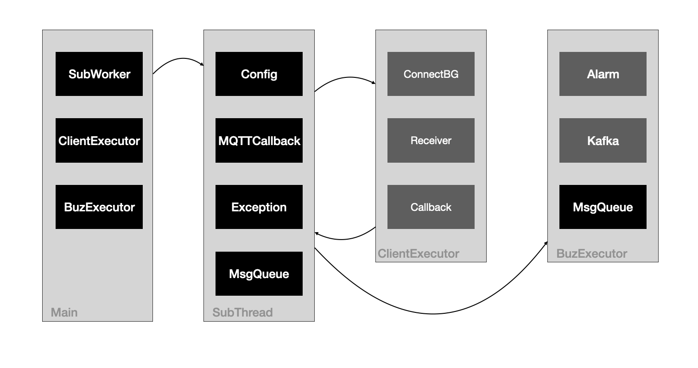
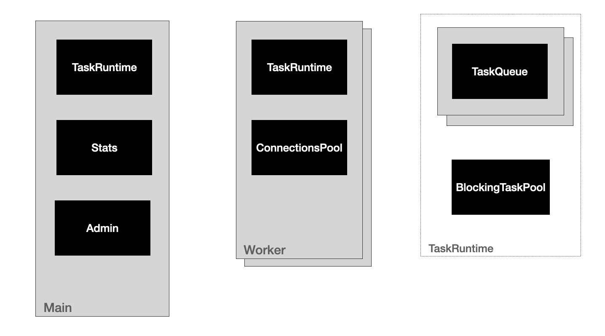

## Paho-Mqtt-Client与线程模型设计

#### 核心类

+ ClientComms，负责连接
+ CommsReceiver，负责网络
+ CommsCallback，负责与Receiver交互，并精简出Callback用户Api

#### 线程模型

#### 建议

+ MqttCallBack不要使用单例或不要有状态，类似Netty Handler的@Shareable注解使用机制
+ Sub线程尽可能的减少业务操作
+ MqttCallBack不要抛出业务错误，业务错误自己处理

#### Edge端线程模型

> Platform订阅的Client有限，所以使用Client-Per-Thread，Edge端建议使用Main-Worker + Pool + EventLoop。

